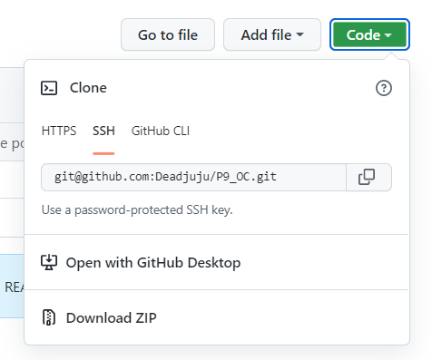

# PROJET 9 - Développez une application Web en utilisant Django
  
  
***
***    
## Sommaire

* [I. Présentation du projet](#chapter1)
    * [L'application](#section1_1)
    * [Vocabulaire de l'application](#section1_2)
* [II. Installation du projet](#chapter2)
    * [Langage utilisé](#section2_1)
    * [Récupération du programme](#section2_2)
    * [Environnement virtuel](#section2_3)
    * [Installer les paquets](#section2_4)
* [III. Utiliser le programme](#chapter3)
* [IV. Base de donnée pré-remplie](#chapter4)
    * [Mot de passe par défaut](#section4_1)
    * [Super-Utilisateur](#section4_2)
    * [Utilisateurs](#section4_3)
    * [Coordonnés des utilisateurs pré-enregistrés](#section4_4)
* [V. Rapport Flake8](#chapter5)

***
***

## I. Présentation du projet 

### L'application 

Ce projet présente le code de l'application web de la startup "***fictive***" **LITReview**.  
L'application est un **MVP** (minimum viable product, ou produit viable minimum) et est un réseau social de partage autour de la littérature.  
  
Chaque **utilisateur** peut suivre d'autres utilisateurs de son choix et être suivi par n'importe quel utilisateur également.  
  
L'application permet de demander ou de publier des critiques ou articles de littérature.

### Vocabulaire de l'application 
  
Un **Ticket** représente l'objet littéraire (un livre, un article, etc.)  
Une **Review** représente la critique d'un ***Ticket***.

*** 

## II. Installation du projet 
  
### Langage utilisé **Python**. 
Ce programme fonctionne au **minimum** sur la version **Python 3.8**. 

### Récupération du programme 

Ouvrez un terminal dans le dossier de destination et entrez la commande suivante pour télécharger le repository:   
 
    git clone https://github.com/Deadjuju/P9_OC.git

Il est également possible de télécharger le fichier zip contenant l'intégralité du code du programme: 
  
   
Rendez-vous ensuite avec le terminal au niveau de la racine du projet en exécutant la commande suivante:

    cd P9_OC

### Environnement virtuel 
  
Dans la racine du dossier:  
     
  1. Taper la commande suivante pour générer l'environnement virtuel:  

    python -m venv env  

> *env* est le nom par défaut de l'environnement virtuel mais peut être nommé différemment.  
  
  2. Activer ensuite l'environnement virtuel:
    
    > Sur Windows  
    - terminal de type bash : source env/Scripts/activate
    - terminal de type shell : env\Scripts\activate
      
    > Sur Mac ou Linux
    - source env/bin/activate

### Installer les paquets 
  3. Pour installer les librairies supplémentaires exécuter la commande suivante:

    pip install -r requirements.txt

L'application web est maintenant prête à être utilisée.  

***  

## III. Lancer le serveur en local 

Depuis le dossier racine du projet rendez vous avec le terminal dans le dossier ***src/***

    cd src/

- Si vous ne **souhaitez pas** utiliser la base de donnée déjà fournie supprimez le dossier ***db.sqlite3*** et exécutez la commande  

        python manage.py migrate  
  
    > Sinon les explications sur la base de donnée incluse sont dans la section suivante.

Et exécutez la commande suivante afin de démarrer le serveur en local

    python manage.py runserver

Ouvrez un navigateur internet et allez sur l'adresse:  
http://127.0.0.1:8000

> Vous pouvez choisir le port en entrant la commande  
python manage.py runserver <numéro-du-port>  
http://127.0.0.1:<numéro-du-port>  
ex:  
python manage.py runserver 8080  
http://127.0.0.1:8080  
  
Enfin, pour arrêter le serveur utilisez les touches *ctrl* + *c* dans le terminal. 

***  

## IV. Base de donnée pré-remplie 

Ce repository vient avec une base de données **sqlite** pré-remplie de quelques comptes utilisateurs afin de pouvoir faire fonctionner très rapidement l'application.

### Mot de passe par défaut   
Le mot de passe de tous les utilisateurs pré-enregistrés est par défaut **S3cret!123**.  
Il est modifiable en se connectant à la session de l'utilisateur.

### Super-Utilisateur 

Par défaut, la base de données comporte un **Super utilisateur**: ***admin***.  
Pour en créer d'autres vous pouvez exécuter la commande suivante dans un terminal dans le **même** répertoire que celui faisant tourner le serveur.  

    python manage.py createsuperuser

> Renseignez ensuite ce qui vous est demandé (Username, email, password)

Vous pourrez ensuite vous connecter sur la page *administration*:  
http://127.0.0.1:8000/admin/  
  
### Utilisateurs 
  
La base de donnée possède par défaut quelques utilisateurs ***fictifs*** ayant déjà publié certains Ticket & Review.  
Les comptes, tickets et reviews peuvent être supprimés/modifiés depuis l'administration du site.

Pour créer un nouvel utilisateur vous pouvez suivre tout simplement le processus (traditionnel) d'inscription sur la page http://127.0.0.1:8000/signup/ . 

### Coordonnés des utilisateurs pré-enregistrés   
Les coordonnés de chaque utilisateur sont listées dans le fichier [users.txt](https://github.com/Deadjuju/P9_OC/blob/main/users.txt) se trouvant à la racine du projet.  
La connexion ne nécessite qu'uniquement le "***Pseudo***" de l'utilisateur et son ***Mot de Passe***.  
Nous vous conseillons de commencer votre expérience avec l'utilisateur ***rastier*** qui possède le *flux* le plus conséquent et le plus de relations avec les autres utilisateurs.
    
## **Bon amusement avec ***LITReview***!**  

***  

## V. Rapport Flake8   

**Flake8** permet d'éplucher le code écrit et de repérer les erreurs de syntaxes et les non conformités avec la PEP.
Un rapport html contenant les éventuelles erreurs peut-être généré.

Il se trouve à la racine du dossier dans le dossier : **flake8_rapport**

> - flake8_rapport
>   - index.html

Un nouveau rapport peut-être généré en exécutant la commande suivante dans le terminal :

    flake8 --format=html --htmldir=flake8_rapport
